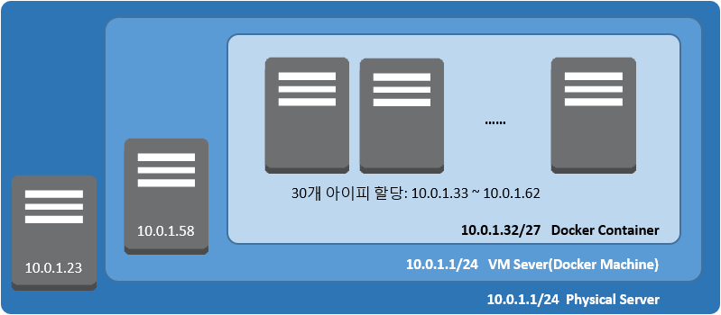
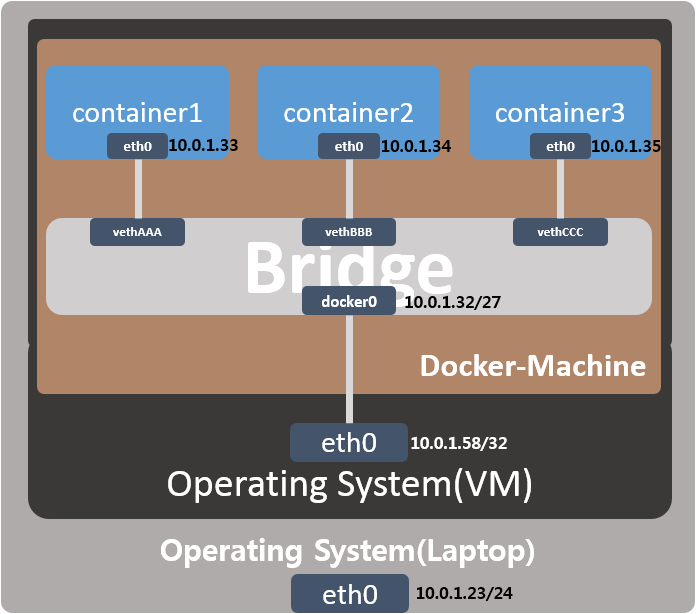
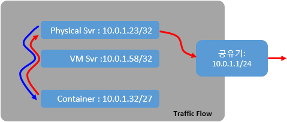

# docker-bridge
Connect a docker container to a local network

<br>
<br>
# Intro

도커 컨테이너(container)와 물리적 서버(docker-engine)를 동일 네트워크 Layer에 구성 함으로 
container와 docker-engine간 port-mapping을 하지 않고 
임의의 client도 container를 하나의 서버로 인식하게 함을 목적으로 합니다.

이 구성은 동일한 배포판을 수십 수백의 다수 client에 배포하여 테스트할때 적절한 구성이 될수 있으며 
변경된 container의 서비스(Web, SSH, DB, etc...)를 commit 전에 테스트 할수 있는 잇점이 있습니다.

container의 local network 설정은 몇가지 방법이 있습니다.
각 방법마다의 장단점이 있지만 본 자료는 제일 간단한 방법을 소개합니다.

<br>
<br>
# Network Topology
Laptop(Windows) : 10.0.1.23
VM Server(Ubuntu) : 10.0.1.58
Container : 10.0.1.32/27 (10.0.1.33~10.0.1.62)






<br>
<br>
# Traffic Flow
데이터 흐름은 Container의 G/W는 VM이 되며 Container의 외부 트래픽은 모두 VM을 통해 외부로 전달됩니다.



<br>
<br>
# Environment

* Host OS : Ubunutu 14.04LTS
* Host IP : 10.0.1.35/32
* Docker-Engine Ver : 1.9.0
* Container IP Range (Max #30) : 10.0.1.32/27 (10.0.1.32~10.0.1.63)
* 주 : container의 gateway는 Host(10.0.1.58)가 됩니다.
* 


<br>
<br>
# Implement 
<br>
<br>
## 1. Install Docker Engine

```
root@ubuntu:~# curl -sSL https://get.docker.com/ | sh
```

<br>
<br>
## 2. Install Linxu Bridge

Docker 설치 후 생성된 브릿지(docker0)를 리눅스 브릿지(br0)로 대체하기 위해 패키지를 설치합니다. 

```
root@ubuntu:~# apt-get install bridge-utils
```

<br>
<br>
## 3. Add Custom Bridge

```
root@ubuntu:~# vi /etc/network/interfaces
# The loopback network interface
auto lo
iface lo inet loopback

# The primary network interface
auto eth0
iface eth0 inet manual

auto br0
iface br0 inet static
address 10.0.1.58
netmask 255.255.255.0
gateway 10.0.1.1
bridge_port eth0
bridge_fd 9
birdge_hello 2
bridge_maxage 12
bridge_stp off
```

<br>
<br>
## 4. Del docker0 Bridge

### 4.1 stop docker
```
root@ubuntu:~# service docker stop
```

### 4.2 del docker0 bridge 
```
root@ubuntu:~# ip link set dev docker0 down
root@ubuntu:~# brctl delbr docker0
```

### 4.3 del default config
```
root@ubuntu:~# iptables -t nat -L -n
root@ubuntu:~# iptables -t nat -F POSTROUTING
```

<br>
<br>
## 5. Configure Docker
docker의 아이피 대역은 외부 네트워크와 동일한 layer에 위치하고 기존 Subnet 수준의 layer로 subnetting 영역을 설정합니다.

container에 할당한 아이피 대역을 지정하는 것은 매우 중요한 과정입니다.

사용할 아이피 대역을 정의하지 않으면 container에 할당되는  아이피가 기존 사용 중인 아이피와 충돌이 발생할수 있어 별도의 subnetting으로 기존 시스템과의 충돌을 피해야 합니다.

```
root@ubuntu:~# echo 'DOCKER_OPTS="-b=br0 --fixed-cidr=10.0.1.32/27"' >> /etc/default/docker
```

<br>
<br>
# 6. autostart add bridge

신규 브리지(br0) 생성과 생성된 브리지에 이더뎃(eth0) 할당을 자동으로 하여
시스템 리부팅 시에도 Docker 환경의 자동 설정을 합니다.

주:부팅시 run-level에서 가상 브리지 설정으로 부팅시간이 다소 소요됩니다.
 
```
root@ubuntu:~# vi /etc/rc.local
…
/sbin/brctl addbr br0
/sbin/brctl addif br0 eth0
/sbin/ifconfig eth0 0.0.0.0 promisc up

exit 0

```

<br>
<br>
# 7. TIP.
container별 할당 아이피 스크립트

```
#!/bin/sh

for id in `/usr/bin/docker ps -a |awk '{print $1}' |grep -v CONTAINER`
do
        ip=`/usr/bin/docker inspect --format '{{ .NetworkSettings.IPAddress }}' ${id}`
        echo $id $ip
done
```

<br>
<br>
# 8. Test

## 8.1 test img pull
```
root@ubuntu:~# docker pull training/webapp
```

## 8.2 create container
app.py
```
root@ubuntu:~# for i in `seq 1 5`; do docker run -d --name webserver-$i training/webapp python app.py ; done
5b4d77ba847a9406a32cb7d7d20e68092a61dd9c1f10920b440b911f68b45810
c4b4d79779f5836c281681befa2dac53f725bd4657049b0b6c2da40c6903751c
0001460fad7a821ce22ad72ea334a842c2f957e941bd4f6790ac6aef8dedc674
63e64ab1367b952283f2e68f2f518b3beac413ced7bf3842f21f0e88032a6f15
cdbfa9dc010022542897a91bdbfab3773264f3254bee503473c77bc45d94032b
```


## 8.3 verify container status
```
root@ubuntu:~# docker ps -a
CONTAINER ID        IMAGE               COMMAND             CREATED              STATUS              PORTS               NAMES
cdbfa9dc0100        training/webapp     "python app.py"     About a minute ago   Up About a minute   5000/tcp            webserver-5
63e64ab1367b        training/webapp     "python app.py"     About a minute ago   Up About a minute   5000/tcp            webserver-4
0001460fad7a        training/webapp     "python app.py"     About a minute ago   Up About a minute   5000/tcp            webserver-3
c4b4d79779f5        training/webapp     "python app.py"     About a minute ago   Up About a minute   5000/tcp            webserver-2
5b4d77ba847a        training/webapp     "python app.py"     About a minute ago   Up About a minute   5000/tcp            webserver-1
```


## 8.4 verify container IP
```
root@ubuntu:~# ./docker-ip 
cdbfa9dc0100 10.0.1.37
63e64ab1367b 10.0.1.36
0001460fad7a 10.0.1.35
c4b4d79779f5 10.0.1.34
5b4d77ba847a 10.0.1.33
```


## 8.5 verify container's service
```
root@ubuntu:~# curl -I http://10.0.1.37:5000
HTTP/1.0 200 OK
Content-Type: text/html; charset=utf-8
Content-Length: 12
Server: Werkzeug/0.10.4 Python/2.7.6
Date: Tue, 10 Nov 2015 17:56:06 GMT

```


# 9. update (ubuntu15.10 + docker1.9.1)

15.x 버전부터는 systemd에서 /etc/default/docker 파일을 무시하고 실행이 됩니다.

```
vi /lib/systemd/system/docker.service
```


```
...
[Service]
ExecStart=/usr/bin/docker -d -H fd:// $DOCKER_OPTS
...
EnvironmentFile=-/etc/default/docker
...
```

```
systemctl daemon-reload
systemctl restart docker
```
